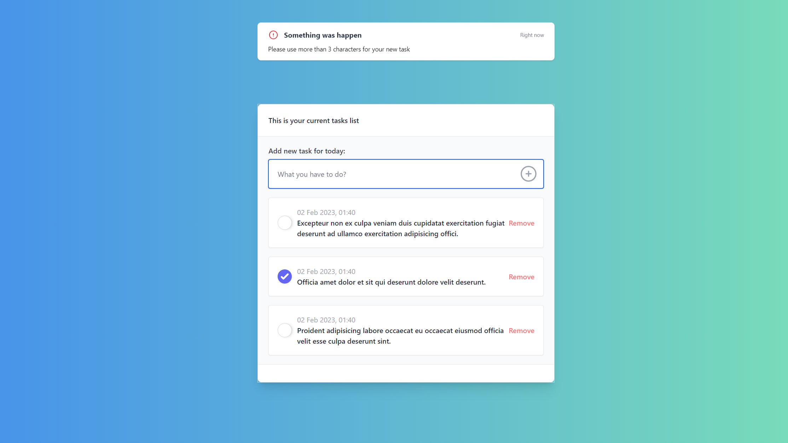

# todolist-v1
 To do list with NodeJS and Express + TailwindCSS

Preview:

Dependencies:
 1. TailwindCSS: https://tailwindcss.com/
 2. Node + Express with EJS: https://ejs.co/
 3. Datetime-js by : https://www.npmjs.com/package/datetime-js
 4. PostCSS.
 5. Concurrently: https://www.npmjs.com/package/concurrently
 6. Nodemon: https://www.npmjs.com/package/nodemon
 
 
Download and run "npm run dev" to start the express server with nodemon + tailwindcss (using Concurrently package).
